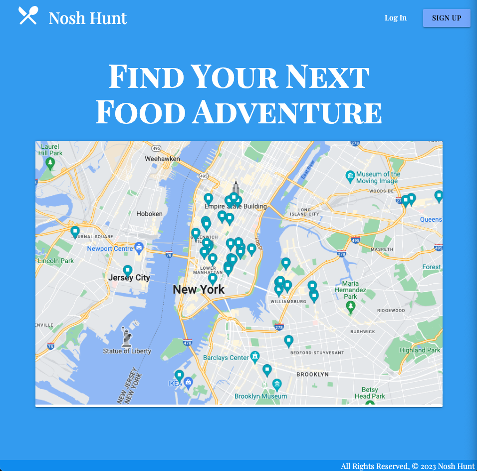

# Nosh Hunt

**Nosh Hunt** is a restaurant tracking app that allows you to add restaurants to user generated lists and categorize the lists based on attributes such as type of cuisine, price range, and location. 

Users have the ability to create, update and delete curated lists of restaurants as well as sign up for the service and log into their account to only see the lists that they have created.

## Screenshots

### Landing Page

### Index Page

### Details Page

## Technologies Used
- HTML
- CSS
- Materialize
- Python
- Django

## Getting Started

[Deployed App](https://nosh-hunt.herokuapp.com/)

[Trello Board](https://trello.com/b/Z0X0ywQv)

[Pitch Deck](https://docs.google.com/presentation/d/1lfBRO46M9AMm05t6cK4qobtgiuWdM43lPjzcRByrKR8/edit?usp=sharing)

## Next Steps
- Implementing comment functionality, allowing users to leave comments on lists and converse with other users.
- Implementing an "All Lists" feature which allows the user to see and search for all lists of all users on the platform.
- Implementing an upvote/downvote feature on lists.
- Implementing the Google Maps API to provide a map widget that shows all of the restaurants associated to a list.